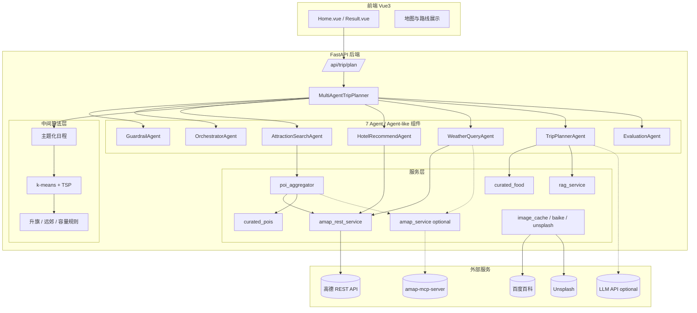
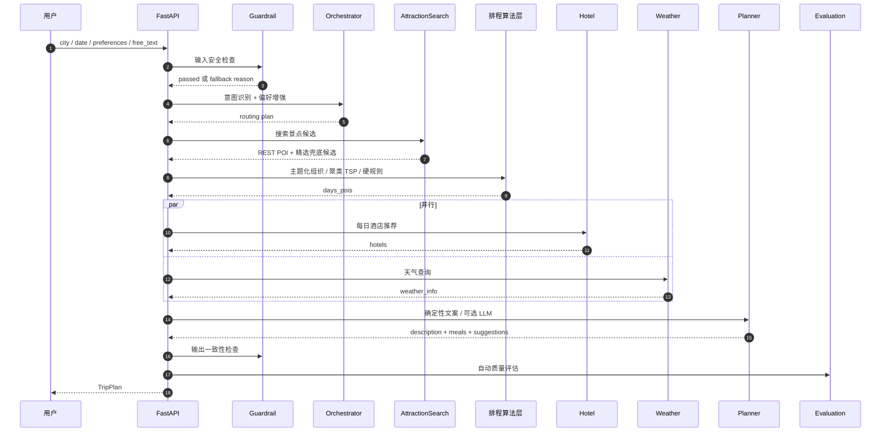
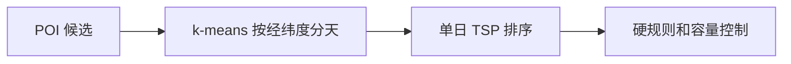
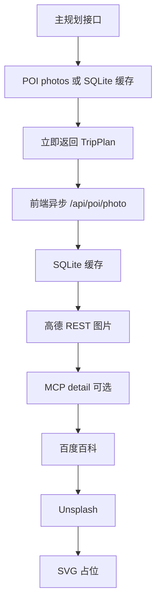

# 智能旅行助手 · 项目架构文档

> 一个面向真实落地场景的多智能体旅行规划系统。
> 当前版本重点解决“规划慢、景点冷门、天气缺失、餐饮空泛重复、行程单调死板”等问题。

---

## 1. 项目一览

| 项 | 内容 |
|---|---|
| 类型 | 全栈 Web 应用 |
| 后端 | Python 3.11 + FastAPI + HelloAgents |
| 前端 | Vue 3 + TypeScript + Ant Design Vue + 高德地图展示 |
| Agent 架构 | 7 Agent / Agent-like 组件 + 中间算法层 |
| 主数据源 | 高德 Web 服务 REST API |
| 可选工具 | amap-mcp-server（默认关闭，用于课程演示或 REST 失败兜底） |
| LLM | OpenAI-compatible，可选开启文案润色 |
| 本地兜底 | 精选景点库、精选餐饮库、城市月份气候参考 |
| 持久化 | SQLite 图片缓存 |
| 核心目标 | 快速生成可执行、不冷门、不单调、餐饮具体的旅行计划 |

---

## 2. 解决的核心痛点

| 用户问题 | 根本原因 | 当前解决方案 |
|---|---|---|
| 景点冷门、单调 | 只按搜索结果或 LLM 生成，缺少热门地标约束 | 高德 REST + 城市地标加权 + 精选景点兜底 + 类别多样化 |
| 行程死板 | 强制塞入“必去”或纯聚类堆点 | 北京 / 上海主题化日程；地标只加权，不强制全部纳入 |
| 每日过载或绕路 | LLM 不计算距离，或聚类后缺少旅行语义 | 主题化排程 + k-means/TSP + 远郊隔离 + 每日容量控制 |
| 天气缺失或 0°C | 天气 API 不稳定时缺少降级 | 高德 REST 天气优先，MCP 可选，失败后用城市月份气候参考 |
| 餐饮太宽泛 | 只写“景点周边餐饮” | 精选餐饮库 + 景点片区标签 + 餐别匹配 + 品牌去重 |
| 规划慢 | LLM/MCP 启动和工具调用阻塞主链路 | REST-first，LLM/MCP 默认关闭，酒店和天气并行 |
| 图片影响响应 | 后端同步取多源图片 | 规划阶段只用 POI 图片/缓存，缺图由前端异步补 |

---

## 3. 整体架构



**分层说明**：

| 层 | 职责 | 关键模块 |
|---|---|---|
| Agent 协作层 | 感知、推理、行动、学习四阶段编排 | `trip_planner_agent.py` |
| 中间算法层 | 排程、距离优化、硬规则 | `itinerary_optimizer.py` + `MultiAgentTripPlanner` 内部规则 |
| 服务层 | POI、天气、酒店、餐饮、RAG、图片等能力封装 | `services/`、`data/` |
| 数据接入层 | 高德 REST、可选 MCP、图片外部源 | `amap_rest_service.py`、`amap_service.py` |

---

## 4. 7 Agent 协作详解



### 为什么是“混合 Agent”

当前项目不把所有判断交给 LLM：

- **算法 / 数据 Agent**：景点搜索、酒店推荐、天气、餐饮匹配都优先由 REST API、本地库和规则完成。
- **LLM Agent**：作为可选文案润色层；默认关闭，避免超时和幻觉。
- **Responsible / Reason / Learn Agent**：护栏、意图调度和自动评估是独立的 Agent-like 组件，便于日志观测和课程展示。
- **中间算法层**：负责聚类、TSP、主题化日程和硬规则，保证路线可执行。

这样既保留 Agentic AI 的分工与可观测性，又让结果更稳定、更快、更可落地。

---

## 5. 关键算法

### 5.1 景点聚合 + 排序（`poi_aggregator.py`）

```python
collect_attractions(city, preferences, free_text):
    1. preferences / free_text -> 搜索关键词
    2. 城市热门地标加入搜索词,但不强制进入最终行程
    3. 高德 REST 并发搜索,失败时可选 MCP fallback
    4. 加入 curated_pois 精选景点兜底
    5. 按 id / name 去重
    6. 过滤餐饮、住宿、购物、停车场、入口、游客中心等噪声
    7. 按评分、A 级、城市地标优先级、主景点程度综合排序
    8. 类别多样化截取 top_n
```

关键变化：只有用户自由文本明确提到的地点才作为强诉求；城市“必去”地标只参与搜索和加权，不再机械硬塞，避免计划死板。

### 5.2 行程优化（`itinerary_optimizer.py`）

普通城市使用：



热门城市北京 / 上海额外使用主题化组织：

| 城市 | 主题示例 |
|---|---|
| 北京 | 中轴线升旗、故宫深度、皇家园林、胡同寺庙、长城远郊、现代艺术 |
| 上海 | 外滩陆家嘴、人民广场博物馆、豫园城隍庙、衡复街区、西岸艺术、朱家角、迪士尼 |

### 5.3 取图链路（5 级 fallback）



规划接口不等待百度百科或 Unsplash，保证生成速度。

### 5.4 升旗仪式硬规则

```python
if "升旗" in free_text:
    把“天安门广场”移动到第 1 天第 1 个景点
    如果同天出现长城等远郊点,优先调出
    控制首日景点数不超过 3 个
```

该规则体现“用户硬诉求优先于算法最短路径”。

### 5.5 酒店打分

酒店推荐流程：

1. 以当天景点质心为中心，先 2km 再 5km 周边搜索。
2. 过滤驿站、招待所、民居等不稳定住宿。
3. 按评分、用户住宿档位、连锁品牌、名称可信度打分。
4. 无真实酒店时，返回“某景点周边住宿区域”作为参考，不编造酒店。

---

## 6. 模块清单

```text
backend/
├── app/
│   ├── agents/
│   │   └── trip_planner_agent.py      # 7 Agent + 主规划流程
│   ├── api/
│   │   ├── main.py                    # FastAPI 应用与 CORS
│   │   └── routes/
│   │       ├── trip.py                # /api/trip/plan
│   │       ├── poi.py                 # POI 搜索 / 详情 / 图片
│   │       ├── map.py                 # 地图 POI / 天气 / 路线接口
│   │       └── agentops.py            # health / metrics / evaluate / precheck
│   ├── data/
│   │   ├── keywords.py                # 偏好关键词、地标、酒店规则
│   │   ├── curated_pois.py            # 热门景点兜底
│   │   ├── curated_food.py            # 具体餐饮店铺兜底
│   │   └── knowledge_base/            # RAG 知识库
│   ├── models/
│   │   └── schemas.py                 # Pydantic 数据模型
│   └── services/
│       ├── amap_rest_service.py       # 高德 REST 搜索/天气/周边/地理编码
│       ├── amap_service.py            # MCP wrapper
│       ├── poi_aggregator.py          # 景点聚合与排序
│       ├── itinerary_optimizer.py     # k-means + TSP
│       ├── hotel_pricing.py           # 住宿价格估算与链接
│       ├── image_cache.py             # SQLite 图片缓存
│       ├── baike_service.py           # 图片兜底
│       ├── unsplash_service.py        # 图片兜底
│       ├── rag_service.py             # TF-IDF RAG
│       ├── guardrail_service.py       # 责任 AI 护栏
│       └── evaluation_service.py      # 自动评估
│
├── tests/                             # pytest 占位，当前暂无实际用例
├── debug_amap.py
├── run.py
└── requirements.txt

frontend/
├── src/
│   ├── views/
│   │   ├── Home.vue
│   │   └── Result.vue
│   ├── services/api.ts
│   ├── types/index.ts
│   └── App.vue
└── package.json
```

---

## 7. 数据流（plan_trip 全过程）

| # | 步骤 | 负责模块 | 说明 |
|---|---|---|---|
| 1 | 输入护栏 | `GuardrailAgent` | 校验、PII 脱敏、注入拦截 |
| 2 | 意图识别 | `OrchestratorAgent` | 根据自由文本增强偏好 |
| 3 | 景点搜索 | `AttractionSearchAgent` / `poi_aggregator` | REST-first 并发搜索 + 精选景点兜底 |
| 4 | 景点过滤排序 | `poi_aggregator` | typecode、噪声名称、地标加权、类别多样化 |
| 5 | 排程 | `_compose_themed_days` / `optimize` | 热门城市主题化，其他城市聚类 TSP |
| 6 | 硬规则 | `_apply_must_first_rules` 等 | 升旗、远郊、每日容量 |
| 7 | 酒店与天气 | `ThreadPoolExecutor` 并行 | 酒店推荐与天气查询互不阻塞 |
| 8 | 文案与餐饮 | `_generate_plan_copy` | 默认确定性生成，包含具体餐饮 |
| 9 | 可选 LLM | `TripPlannerAgent` | 开启后有超时保护，失败回退模板 |
| 10 | 拼装模型 | `_assemble_plan` | 回填景点、酒店、天气、预算 |
| 11 | 输出护栏 | `OutputGuardrail` | 记录未授权地名等问题 |
| 12 | 自动评估 | `EvaluationAgent` | 评分与 warnings |
| 13 | 前端异步取图 | `/api/poi/photo` | 不阻塞主规划接口 |

---

## 8. API 接口

### 8.1 后端 REST

| Method | Path | 说明 |
|---|---|---|
| POST | `/api/trip/plan` | 主规划接口 |
| GET | `/api/trip/health` | 规划服务健康检查 |
| GET | `/api/poi/search` | POI 搜索 |
| GET | `/api/poi/detail/{poi_id}` | POI 详情 |
| GET | `/api/poi/photo` | 景点图片兜底接口 |
| GET | `/api/poi/photo/stats` | 图片缓存统计 |
| GET | `/api/map/poi` | 地图服务 POI 搜索 |
| GET | `/api/map/weather` | 地图服务天气查询 |
| POST | `/api/map/route` | 路线规划 |
| GET | `/api/map/health` | 地图服务健康检查 |
| GET | `/api/agents/health` | AgentOps 健康状态 |
| GET | `/api/agents/metrics` | 运行指标 |
| POST | `/api/agents/evaluate` | 事后质量评估 |
| POST | `/api/agents/guardrail/precheck` | 输入预检 |

### 8.2 前端接口与环境变量

| 项 | 当前实现 |
|---|---|
| 后端基址 | `VITE_API_BASE_URL`，默认 `http://localhost:8000` |
| 主规划调用 | `POST /api/trip/plan` |
| 健康检查 | `GET /health` |
| 异步取图 | `GET /api/poi/photo?name=...&city=...` |
| 地图 JS Key | `VITE_AMAP_WEB_JS_KEY`，供 `@amap/amap-jsapi-loader` 使用 |

### 8.3 关键数据模型（`schemas.py`）

```python
class TripRequest:
    city: str
    start_date: str
    end_date: str
    travel_days: int
    transportation: str
    accommodation: str
    preferences: list[str]
    free_text_input: str

class TripPlan:
    city: str
    days: list[DayPlan]
    weather_info: list[WeatherInfo]
    overall_suggestions: str
    budget: Budget | None

class Meal:
    type: str
    name: str
    address: str | None
    location: Location | None
    description: str | None
    estimated_cost: int
```

---

## 9. 配置与环境

### 9.1 .env 必要变量

```bash
AMAP_API_KEY=your_amap_web_service_key

# 可选 LLM
LLM_API_KEY=sk-xxxx
LLM_BASE_URL=https://dashscope.aliyuncs.com/compatible-mode/v1
LLM_MODEL_ID=qwen-plus

# 当前主链路推荐关闭,保证速度和稳定性
ENABLE_LLM_PLANNER=false
LLM_PLANNER_TIMEOUT_SECONDS=12
ENABLE_MCP_TOOLS=false

# 可选图片兜底
UNSPLASH_ACCESS_KEY=xxxx
UNSPLASH_SECRET_KEY=xxxx

HOST=0.0.0.0
PORT=8000
LOG_LEVEL=INFO
CORS_ORIGINS=http://localhost:5173,http://localhost:3000,http://127.0.0.1:5173,http://127.0.0.1:3000
```

### 9.2 前端 .env

```bash
VITE_API_BASE_URL=http://localhost:8000
VITE_AMAP_WEB_JS_KEY=your_amap_web_js_key
```

### 9.3 启动命令

```bash
# 后端
cd backend
.venv\Scripts\python.exe run.py

# 前端
cd frontend
npm run dev
```

启动后访问：

- 后端文档：`http://localhost:8000/docs`
- 前端页面：`http://localhost:5173`

---

## 10. 关键设计决策记录

| 决策 | 选择 | 原因 |
|---|---|---|
| 主链路数据源 | REST-first | 比 MCP 启动快，字段更完整，适合在线规划 |
| MCP | 默认关闭，可选开启 | 满足课程展示，同时不影响实际规划速度 |
| LLM 文案 | 默认确定性模板，可选 LLM | 避免 LLM 慢和幻觉；需要自然文案时可开启 |
| 景点策略 | 地标加权，不全部强制 | 解决“太死板”和“冷门”之间的平衡 |
| 北京 / 上海排程 | 主题化优先 | 更符合真实旅游体验 |
| 餐饮推荐 | 精选库 + 上下文匹配 | 输出具体店铺，避免泛泛而谈 |
| 天气失败 | 气候参考兜底 | 不再显示明显错误的 0°C |
| 图片 | 前端异步兜底 | 不拖慢主规划接口 |

---

## 11. 测试与可观测性

### 11.1 本地验证

```bash
cd backend
.venv\Scripts\python.exe -m compileall app

cd ../frontend
npm.cmd run build
```

当前 `backend/tests/` 只有测试包占位，还没有实际 pytest 用例；后续补充用例后可再执行 `.venv\Scripts\python.exe -m pytest tests/ -v`。

### 11.2 端到端诊断

```bash
cd backend
.venv\Scripts\python.exe debug_amap.py
```

用于检查高德 API key、POI 搜索、详情、天气、图片兜底链路。

### 11.3 日志

日志目录：`backend/logs/`

典型日志包括：

```text
[Perceive] 输入护栏检查
[Reason] 意图识别与偏好增强
景点聚合 city=上海 keywords=... raw=... 最终=...
上海主题化行程: Day1 外滩陆家嘴夜景 ...
第1天选定酒店: ...
天气 API 暂无可用结果,使用城市季节气候参考
[Learn] 自动质量评估
```

---

## 12. 故障排查

| 现象 | 可能原因 | 处理 |
|---|---|---|
| 后端启动失败 | `AMAP_API_KEY` 未配置 | 检查 `backend/.env` |
| PowerShell 运行 `npm run build` 报策略错误 | `npm.ps1` 执行策略限制 | 使用 `npm.cmd run build` |
| 天气为空 | 高德天气接口不可达或 key 限制 | 查看日志；系统会使用气候参考兜底 |
| 景点仍偏冷门 | 城市不在精选库或高德结果质量差 | 增加 `curated_pois.py` 或 `CITY_LANDMARKS` |
| 餐厅重复 | 当前城市餐饮库不足 | 增加 `curated_food.py` 对应片区和餐别 |
| 规划慢 | 开启了 LLM 或 MCP | 关闭 `ENABLE_LLM_PLANNER` / `ENABLE_MCP_TOOLS` |
| 图片加载慢 | 外部图片源不可达 | 主计划不受影响；图片接口会逐级降级 |

---

## 13. 后续可扩展方向

- 增加更多城市的精选景点与餐饮库。
- 接入真实餐厅搜索与评价 API，替代部分静态餐饮库。
- 增加开闭馆时间、预约难度、节假日拥挤度等约束。
- 支持多酒店连续住宿策略，减少频繁换酒店。
- 增加用户反馈数据，做偏好学习和行程再排序。
- 用 Playwright 或端到端测试覆盖前端规划展示。

---

## 14. 提交链 / 版本历程

```text
P0  feat(amap): 实现高德解析层
P1  feat(trip-planner): 重构景点/行程/酒店流程
P2  feat(image): SQLite 缓存 + 图片 fallback
P3  feat(agentops): 增加 Guardrail / Evaluation / Observability
P4  perf(planner): REST-first, MCP 默认可选
P5  feat(weather): REST 天气 + 气候参考兜底
P6  feat(poi): 精选景点库 + 地标加权 + 噪声过滤
P7  feat(food): 精选餐饮库 + 片区匹配 + 品牌去重
P8  feat(route): 北京 / 上海主题化日程
P9  docs: 更新 README 和 ARCHITECTURE 至当前实现
```

---
