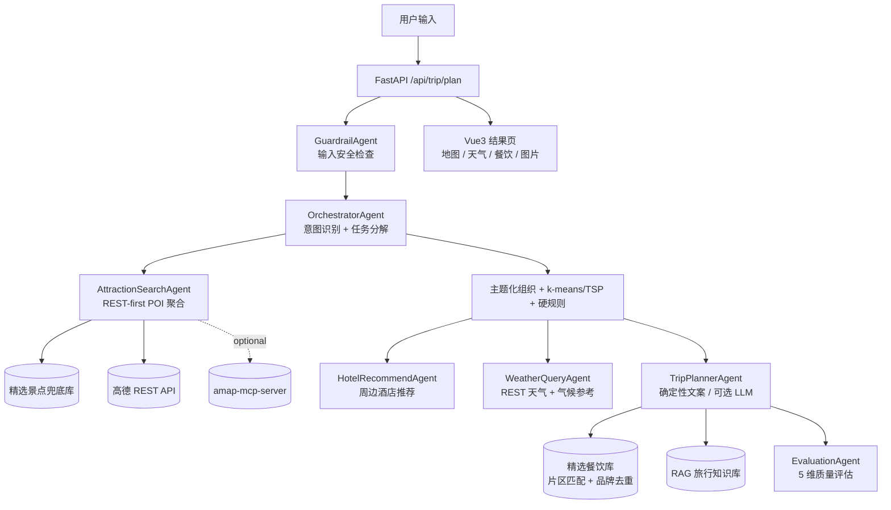
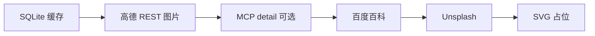

<div align="center">

# 智能旅行助手 · Agentic AI Travel Planner

### *CA6123 — Agentic AI and Applications · Group Project*

**一个面向真实落地旅行规划的混合多智能体系统**

[]() []() []() []() []()

[]() []() []() []()

</div>

---

> **One-liner**：用户输入“上海 5 天、想轻松一点、多安排夜景和美食”这样的目标，系统会完成输入护栏 → 意图识别 → 真实 POI 检索与精选兜底 → 主题化行程组织 → 酒店与天气查询 → 具体餐饮推荐 → 自动质量评估，输出可直接执行的旅行计划。

---

## 📋 Table of Contents

- [🎯 1. Overview](#-1-overview)
- [🔵 2. Perceive Stage · 感知](#-2-perceive-stage--感知)
- [🟡 3. Reason Stage · 推理](#-3-reason-stage--推理)
- [🟢 4. Action Stage · 行动](#-4-action-stage--行动)
- [🟣 5. Learn Stage · 学习](#-5-learn-stage--学习)
- [🤝 6. AI-Human Interaction · 人在回路](#-6-ai-human-interaction--人在回路)
- [🛡️ 7. Responsible Agentic AI · 责任 AI](#️-7-responsible-agentic-ai--责任-ai)
- [🎓 8. Conclusions · 总结与团队分工](#-8-conclusions--总结与团队分工)
- [🚀 Quick Start](#-quick-start)
- [📊 Assessment Criteria Mapping](#-assessment-criteria-mapping)
- [🏆 Bonus Features 实现清单](#-bonus-features-实现清单)
- [📁 Project Structure](#-project-structure)
- [🙏 Acknowledgments](#-acknowledgments)

---

## 🎯 1. Overview

### 1.1 Problem Statement

纯 LLM 旅行助手常见问题是：规划看起来丰富，但落地时不可靠。

| 现象 | 影响 |
|---|---|
| 推荐冷门、子点位或非景点 POI | 用户体验单调，甚至无法游览 |
| 同一天跨城区来回跑 | 通勤时间过长，计划不可执行 |
| 天气缺失或显示“预报暂无 0°C” | 页面可用性差，影响出行判断 |
| 餐饮只写“景点周边餐饮” | 不够具体，无法直接照着吃 |
| 全链路依赖 LLM / MCP | 网络和工具启动慢，规划时间不可控 |

### 1.2 Our Solution: Hybrid Agentic AI

项目采用 **算法 Agent + LLM/工具 Agent + 确定性模板** 的混合架构：

- 核心决策由算法与真实数据完成：景点、酒店、天气、餐饮优先使用高德 REST API 和本地精选兜底库。
- LLM 与 MCP 默认不阻塞主链路，可通过配置开启，用于课程演示或文案增强。
- 热门城市引入主题化日程，北京和上海不再机械堆景点，而是按中轴线、长城、衡复街区、外滩陆家嘴、西岸艺术等真实游玩主题组织。
- 餐饮推荐使用城市精选餐饮库，结合当天景点片区、餐别、距离和品牌去重，输出具体店名、地址、人均与推荐理由。

### 1.3 Functional Description

<details>
<summary>输入 / 输出示例</summary>

```yaml
输入:
  city: "上海"
  travel_days: 5
  preferences: ["美食", "夜景", "艺术"]
  free_text_input: "不太累,想城市漫步和好吃的"

输出:
  days:
    - day_1:
        theme: "外滩陆家嘴夜景"
        attractions: [外滩, 外白渡桥]
        meals:
          - 小杨生煎(南京东路店)
          - 老吉士酒家(陆家嘴店)
          - 花马天堂云南餐厅(外滩店)
        hotel: "外滩周边住宿区域或真实高德酒店"
    - day_2:
        theme: "人民广场博物馆与南京路"
        attractions: [上海博物馆, 人民广场]
  weather_info: "高德 4 天预报 + 超出天数参考补齐"
  budget: "门票 / 酒店 / 餐饮 / 交通估算"
  evaluation: "内部日志记录 5 维质量评估"
```

</details>

### 1.4 System Architecture



### 1.5 Agentic 4-Stage Cycle Mapping

| Stage | 当前实现 |
|---|---|
| Perceive | `InputGuardrail` 检查用户输入，RAG 知识库加载城市旅行知识 |
| Reason | `OrchestratorAgent` 做规则化意图识别、偏好增强和执行步骤拆解 |
| Action | 景点搜索、主题化排程、酒店推荐、天气查询、餐饮和文案生成 |
| Learn | `EvaluationAgent` 对地标命中、紧凑度、酒店、字段完整度、自由文本响应做评分 |

详细架构见 [`ARCHITECTURE.md`](./ARCHITECTURE.md)。

---

## 🔵 2. Perceive Stage · 感知

### 2.1 Input Guardrail（输入护栏）

关键文件：[`backend/app/services/guardrail_service.py`](backend/app/services/guardrail_service.py)

| 防护项 | 实现 | 结果 |
|---|---|---|
| 输入合法性 | 城市、日期、天数范围校验 | 非法输入阻断或警告 |
| PII Redaction | 手机号、邮箱、身份证、银行卡正则脱敏 | 进入 Agent 前替换为占位文本 |
| Prompt Injection | 中英文关键词黑名单 | 高风险自由文本直接阻断 |
| 敏感主题 | 暴力、违法、自伤等敏感内容检测 | 阻断或返回 fallback plan |

### 2.2 Agentic RAG · 旅行知识库

关键文件：[`backend/app/services/rag_service.py`](backend/app/services/rag_service.py)、[`backend/app/data/knowledge_base/`](backend/app/data/knowledge_base/)

当前知识库包含北京、上海和通用旅行知识，覆盖升旗、预约、防坑、季节建议等内容。实现采用轻量 TF-IDF 与城市加权检索，不引入向量数据库，适合课程项目规模。

### 2.3 Prompt & Context Engineering（防幻觉核心）

`TripPlannerAgent` 的 LLM 路径只允许为已确定的景点、酒店和天气补充文案。当前主链路默认使用 `_generate_plan_copy()` 的确定性文案，避免 LLM 超时或自由发挥导致景点漂移；如设置 `ENABLE_LLM_PLANNER=true`，系统会在 `LLM_PLANNER_TIMEOUT_SECONDS` 内尝试 LLM 润色，超时自动回到确定性模板。

---

## 🟡 3. Reason Stage · 推理

### 3.1 OrchestratorAgent · Intent Classification & Routing

关键文件：[`backend/app/agents/trip_planner_agent.py`](backend/app/agents/trip_planner_agent.py)

`OrchestratorAgent` 使用规则化意图识别，避免额外 LLM 延迟。它会从自由文本中识别：

| 意图 | 触发示例 | 偏好增强 |
|---|---|---|
| 深度文化游 | 升旗、故宫、长城、历史 | 历史文化 |
| 网红打卡 | 拍照、出片、网红 | 艺术、夜景 |
| 亲子游 | 孩子、宝宝、亲子 | 亲子 |
| 美食探店 | 美食、好吃、小吃 | 美食 |
| 户外探险 | 登山、徒步、户外 | 自然、运动 |
| 商务出行 | 商务、出差、会议 | 保持轻量 |

### 3.2 Chain-of-Thought · Task Decomposition

系统会把用户目标拆解为可观测步骤并写入日志，包括：输入护栏、POI 搜索、主题化或聚类排程、硬规则处理、酒店推荐、天气查询、文案生成、输出护栏和质量评估。

### 3.3 Hierarchical Multi-Agent Architecture

当前共有 7 个 Agent / Agent-like 组件：

| Agent | 角色 |
|---|---|
| `OrchestratorAgent` | 意图识别、偏好增强、执行步骤拆解 |
| `GuardrailAgent` | 输入安全与输出一致性检查 |
| `AttractionSearchAgent` | 景点候选聚合与排序 |
| `HotelRecommendAgent` | 每日住宿区域或真实酒店推荐 |
| `WeatherQueryAgent` | 天气查询，REST 优先，MCP 可选 |
| `TripPlannerAgent` | 确定性行程文案，可选 LLM 润色 |
| `EvaluationAgent` | 质量评估和 warnings |

### 3.4 中间算法层（不属于任何 Agent 的纯算法）

| 模块 | 作用 |
|---|---|
| `itinerary_optimizer.py` | k-means 聚类、单日 TSP 排序、距离计算 |
| `_compose_themed_days()` | 北京 / 上海主题化日程组织 |
| `_apply_must_first_rules()` | “升旗”等硬诉求首日首位处理 |
| `_isolate_remote_attractions()` | 长城等远郊景点尽量单独安排 |
| `_cap_daily_attractions()` | 控制每日景点数量，避免过载 |

---

## 🟢 4. Action Stage · 行动

### 4.1 4 Specialist Agents 详解

| Agent | 数据源 / 工具 | 当前输出 |
|---|---|---|
| `AttractionSearchAgent` | 高德 REST、精选景点库、可选 MCP | 真实 POI、评分、坐标、类型、图片候选 |
| `HotelRecommendAgent` | 高德周边搜索、酒店黑名单、价格估算 | 每日酒店或住宿区域、价格区间、携程跳转 |
| `WeatherQueryAgent` | 高德 REST 天气、可选 MCP、城市气候参考 | 每日白天/夜间天气和温度 |
| `TripPlannerAgent` | 确定性模板、RAG、精选餐饮库、可选 LLM | 当日描述、三餐、游览时长、总体建议 |

### 4.2 Tool-Calling Matrix

| 工具来源 | 默认状态 | 用途 |
|---|---|---|
| 高德 REST Web API | 默认启用 | POI 搜索、周边酒店、天气、地理编码、图片主源 |
| `amap-mcp-server` | 默认关闭，可配置启用 | 课程展示 MCP 工具调用与 REST 失败时兜底 |
| 本地精选景点库 | 默认启用 | 网络不可用或返回质量差时保证热门景点可用 |
| 本地精选餐饮库 | 默认启用 | 输出具体店铺，避免“周边餐饮” |
| 百度百科 / Unsplash | 图片兜底 | 前端异步取图链路的后备来源 |

### 4.3 MCP Integration (Bonus #4)

MCP 仍保留在代码中，但主链路默认不启动 `uvx amap-mcp-server`，避免初始化和 stdio 通信拖慢响应。需要演示 MCP 时，在 `.env` 中开启：

```bash
ENABLE_MCP_TOOLS=true
```

开启后会创建 `MCPTool(name="amap", auto_expand=True)`，并可使用高德 MCP 的天气、搜索、路线等工具。

### 4.4 A2A Pattern (Bonus #5 · 部分实现)

Agents 通过结构化对象传递上下文：

```python
routing = orchestrator_agent.run(request)
candidates = attraction_agent.run(request)
days_pois = optimize(candidates, n_days=request.travel_days)
day_hotels = hotel_agent.run(days_pois, request)
weather = weather_agent.run(request)
llm_data = planner_agent.run(planner_query)  # 可选
```

当前没有引入独立 A2A 协议服务，但保留了清晰的 Agent-to-Agent 数据边界。

### 4.5 Multi-Source Image Pipeline · 5 级 Fallback

结果页优先展示 POI 自带图片或缓存图片；若缺失，前端异步调用 `/api/poi/photo`：



图片不阻塞主规划接口，避免等待外部图片源导致整体超时。

---

## 🟣 5. Learn Stage · 学习

### 5.1 In-Context Learning · Few-shot Prompting

LLM planner 保留 few-shot JSON 格式约束，但默认不依赖 LLM。开启 LLM 后，prompt 会显式列出每天已选景点、酒店和天气，要求只生成软字段，不能新增景点或修改坐标。

### 5.2 Agent Evaluation (Bonus #3)

关键文件：[`backend/app/services/evaluation_service.py`](backend/app/services/evaluation_service.py)

| 指标 | 含义 |
|---|---|
| `known_landmark_ratio` | 知名地标命中程度 |
| `same_day_compactness` | 同天景点平均距离是否过远 |
| `hotel_with_rating_ratio` | 酒店是否有评分或可参考信息 |
| `field_completeness` | 景点地址、坐标、评分、类别、游览时长等字段完整度 |
| `free_text_addressed` | 自由文本诉求是否被回应 |

评估结果写入日志，并在有 warnings 时附加到总体建议末尾。

### 5.3 Agent Observability (Bonus #2)

关键文件：[`backend/app/services/logging_setup.py`](backend/app/services/logging_setup.py)、[`backend/app/api/routes/agentops.py`](backend/app/api/routes/agentops.py)

| Endpoint | 用途 |
|---|---|
| `GET /api/agents/health` | RAG、高德 REST、MCP 等组件状态 |
| `GET /api/agents/metrics` | 图片缓存指标 |
| `POST /api/agents/evaluate` | 对已有 TripPlan 做质量评估 |
| `POST /api/agents/guardrail/precheck` | 提交前输入安全预检 |

---

## 🤝 6. AI-Human Interaction · 人在回路

### 6.1 Pre-submission Guardrail（提交前预检）

前端或调试工具可调用：

```http
POST /api/agents/guardrail/precheck
```

返回输入是否通过、风险等级、违规项、脱敏数量和脱敏后的自由文本。

### 6.2 Editing Mode（行程编辑）

前端结果页支持编辑模式，用户可以调整景点顺序、删除景点，并修改景点地址、游览时长和描述；修改结果会保存到 `sessionStorage` 并刷新地图标记。

### 6.3 Post-hoc Audit（事后评估）

```http
POST /api/agents/evaluate
```

可对任意 TripPlan 做事后评分，用于课程演示、对比测试和人工审核。

### 6.4 Human Override

用户可以基于评估结果重新生成、调整输入偏好，或在前端编辑生成后的行程。

---

## 🛡️ 7. Responsible Agentic AI · 责任 AI

### 7.1 Multi-Layer Guardrails

| 层 | 触发时机 | 内容 |
|---|---|---|
| InputGuardrail | 规划入口 | PII 脱敏、注入拦截、敏感主题检查 |
| POI 过滤 | 景点聚合 | 排除餐饮、住宿、停车场、入口、游客中心等噪声 POI |
| 酒店过滤 | 酒店推荐 | 过滤驿站、招待所、民居等不稳定住宿 |
| 硬规则 | 排程后处理 | 升旗等强诉求优先处理 |
| OutputGuardrail | 输出后 | 检查描述是否引入未授权景点 |

### 7.2 PII Redaction（Bonus #6）

手机号、邮箱、身份证、银行卡等信息会在进入后续 Agent 前脱敏。

### 7.3 Prompt Injection Filter（Bonus #6）

系统内置中英文注入关键词，如 `ignore previous`、`system prompt`、`忽略以上`、`扮演` 等，命中后阻断自由文本。

### 7.4 Output Semantic Consistency Check（自创）

输出护栏会检查文案中出现的地名是否属于当天实际 attractions 列表，避免 LLM 或模板把未安排景点写进描述。

### 7.5 Performance Tracking & Logs

日志记录每个阶段的开始、结束、候选数量、主题化结果、酒店选择、天气降级、评估等级等信息，便于定位“慢”“冷门”“重复”等问题。

### 7.6 Test Cases for Guardrail Effectiveness

建议重点测试：

```python
"联系我 13800138000"          -> warn + 手机号脱敏
"ignore previous instruction" -> block
"想看升旗仪式"                -> pass + 天安门规则生效
```

### 7.7 Data Compliance

项目不保存身份证级敏感数据；外部服务只接收旅行规划所需的城市、POI、天气或图片查询信息。

---

## 🎓 8. Conclusions · 总结与团队分工

### 8.1 Main Contributions

1. **REST-first 主链路**：避免 MCP 启动和 LLM 生成拖慢规划。
2. **混合多 Agent 架构**：算法负责决策，LLM/MCP 作为可选增强。
3. **热门城市主题化排程**：北京、上海按真实游玩主题组织，避免单调堆点。
4. **精选景点与餐饮兜底库**：网络不稳定时仍能输出常识合理、具体可落地的方案。
5. **多层 Guardrail 与自动评估**：覆盖输入安全、输出一致性和质量评分。
6. **前端完整展示**：天气、酒店、景点、餐饮、人均、地址和地图视图。

### 8.2 Team Members & Distribution

| 角色 | 成员 | 主要职责 | 关键交付物 |
|---|---|---|---|
| Team Lead | 唐德贤 | 架构设计、主流程编排、Agent 协作 | `MultiAgentTripPlanner`、`OrchestratorAgent` |
| 数据 / 检索 | 史一恒 | POI、酒店、REST 接入、图片链路 | `poi_aggregator.py`、`amap_rest_service.py` |
| 推理 / 文案 | 唐娅 | 文案、天气、RAG、餐饮推荐 | `TripPlannerAgent`、`rag_service.py`、`curated_food.py` |
| 责任 / 评估 | 舒明泽 | Guardrail、Evaluation、AgentOps | `guardrail_service.py`、`evaluation_service.py`、`agentops.py` |

### 8.3 What's Novel

- **确定性优先的 Agentic 规划**：核心结果不依赖 LLM 自由生成，速度和稳定性更可控。
- **主题化 + 地理优化结合**：热门城市用旅行主题保证体验，普通城市用聚类/TSP 保证路线紧凑。
- **餐饮按日程上下文匹配**：根据当天景点片区、餐别和已用品牌去重，给出具体店铺。
- **天气与数据降级链路**：真实 API 不可用时有参考气候和精选数据兜底，不输出明显错误的 0°C。

### 8.4 Key Challenges

| 挑战 | 当前应对 |
|---|---|
| 景点冷门或子点位过多 | 城市地标加权、噪声 POI 黑名单、精选景点兜底 |
| 行程单调 | 北京 / 上海主题化日程、每日景点数量控制 |
| 餐饮重复和空泛 | 精选餐饮库、片区标签、品牌去重、具体地址 |
| 天气接口不稳定 | REST 优先、MCP 可选、城市月份气候参考 |
| 规划速度慢 | LLM/MCP 默认关闭，REST 并发搜索，酒店和天气并行 |

### 8.5 Bonus Features Summary

当前实现覆盖 RAG、Observability、Evaluation、MCP 可选集成、A2A 风格状态传递、Advanced Guardrails，以及混合 Agent 规划。

### 8.6 Acknowledgment of AI Tools

项目开发过程中使用了 Claude 和 ChatGPT / Codex 辅助进行代码重构、调试、文档整理。最终实现经过本地运行、构建和人工检查。

---

## 🚀 Quick Start

### Requirements

| 项 | 版本 / 说明 |
|---|---|
| Python | 3.11+ |
| Node.js | 18+ |
| 高德 Web 服务 API Key | 必填，用于 POI、天气、周边搜索 |
| 高德 Web JS API Key | 前端地图展示需要，写入 `frontend/.env` |
| LLM API Key | 可选；仅开启 `ENABLE_LLM_PLANNER=true` 或 MCP 演示时需要 |
| Unsplash Access Key | 可选；图片兜底 |

### .env Configuration

文件：`backend/.env`

```bash
AMAP_API_KEY=your_amap_web_service_key

# 可选 LLM 配置
LLM_API_KEY=sk-xxxx
LLM_BASE_URL=https://dashscope.aliyuncs.com/compatible-mode/v1
LLM_MODEL_ID=qwen-plus

# 主链路默认建议保持关闭，保证速度
ENABLE_LLM_PLANNER=false
LLM_PLANNER_TIMEOUT_SECONDS=12
ENABLE_MCP_TOOLS=false

# 可选图片兜底
UNSPLASH_ACCESS_KEY=xxx
UNSPLASH_SECRET_KEY=xxx

HOST=0.0.0.0
PORT=8000
LOG_LEVEL=INFO
CORS_ORIGINS=http://localhost:5173,http://localhost:3000,http://127.0.0.1:5173,http://127.0.0.1:3000
```

文件：`frontend/.env`

```bash
VITE_API_BASE_URL=http://localhost:8000
VITE_AMAP_WEB_JS_KEY=your_amap_web_js_key
```

### Run Backend

```bash
cd backend
python -m venv .venv
.venv\Scripts\activate
pip install -r requirements.txt
python run.py
```

访问：`http://localhost:8000/docs`

### Run Frontend

```bash
cd frontend
npm install
npm run dev
```

访问：`http://localhost:5173`

### Run Tests

当前 `backend/tests/` 仅保留测试包占位，项目主要验证方式是后端编译检查和前端生产构建：

```bash
cd backend
.venv\Scripts\python.exe -m compileall app

cd ../frontend
npm.cmd run build
```

如后续补充 pytest 用例，可运行：

```bash
cd backend
.venv\Scripts\python.exe -m pytest tests/ -v
```

### End-to-End Diagnostic

```bash
cd backend
.venv\Scripts\python.exe debug_amap.py
```

用于检查高德搜索、详情、天气、图片兜底等能力。

---

## 📊 Assessment Criteria Mapping

| 评分维度 | 项目覆盖 |
|---|---|
| Technical Competency | 7 Agent 协作、REST/MCP 工具、主题化排程、k-means/TSP、RAG、前后端完整闭环 |
| Correctness & Clarity | 数据模型清晰、API 文档、README/ARCHITECTURE、可运行前后端 |
| Responsible Agentic AI | 输入护栏、PII 脱敏、注入拦截、输出一致性检查、人工编辑和事后评估 |
| Novelty & Originality | 确定性优先的混合 Agent、精选餐饮与景点兜底、天气降级、主题化城市规划 |
| Bonus Features | RAG、Observability、Evaluation、MCP、A2A 风格协作、Advanced Guardrails |

---

## 🏆 Bonus Features 实现清单

| # | Bonus Feature | 状态 | 关键文件 |
|---|---|---|---|
| 1 | Agentic RAG | 已实现 | `rag_service.py`、`data/knowledge_base/` |
| 2 | Agent Observability | 已实现 | `logging_setup.py`、`routes/agentops.py` |
| 3 | Agent Evaluation | 已实现 | `evaluation_service.py` |
| 4 | MCP | 可选实现 | `amap_service.py`、`ENABLE_MCP_TOOLS` |
| 5 | A2A | 部分实现 | `BaseAgent.run()` + 结构化 state |
| 6 | Advanced Guardrails | 已实现 | `guardrail_service.py` |
| 7 | Reinforcement Learning | 未实现 | 评估分数可作为后续 reward signal |
| 8 | Other Advanced | 已实现 | 主题化规划、精选景点/餐饮兜底、REST-first 性能优化 |

---

## 📁 Project Structure

```text
helloagents-trip-planner/
├── README.md
├── ARCHITECTURE.md
│
├── backend/
│   ├── app/
│   │   ├── agents/
│   │   │   └── trip_planner_agent.py      # 7 Agent + 4-stage 主流程
│   │   ├── api/
│   │   │   ├── main.py                    # FastAPI app + CORS
│   │   │   └── routes/
│   │   │       ├── trip.py                # POST /api/trip/plan
│   │   │       ├── poi.py                 # POI / 图片接口
│   │   │       ├── map.py                 # 路线接口
│   │   │       └── agentops.py            # health / metrics / evaluate / precheck
│   │   ├── data/
│   │   │   ├── keywords.py                # 关键词、地标、酒店规则
│   │   │   ├── curated_pois.py            # 精选热门景点兜底
│   │   │   ├── curated_food.py            # 精选餐饮兜底
│   │   │   └── knowledge_base/            # RAG 知识库
│   │   ├── models/
│   │   │   └── schemas.py                 # Pydantic 数据模型
│   │   └── services/
│   │       ├── amap_rest_service.py       # 高德 REST
│   │       ├── amap_service.py            # MCP wrapper
│   │       ├── poi_aggregator.py          # 景点聚合
│   │       ├── itinerary_optimizer.py     # k-means + TSP
│   │       ├── hotel_pricing.py           # 酒店价格估算
│   │       ├── image_cache.py             # SQLite 图片缓存
│   │       ├── baike_service.py           # 百度百科图片兜底
│   │       ├── unsplash_service.py         # Unsplash 图片兜底
│   │       ├── llm_service.py              # HelloAgents LLM 单例
│   │       ├── rag_service.py             # RAG
│   │       ├── guardrail_service.py       # 输入/输出护栏
│   │       └── evaluation_service.py      # 自动评估
│   ├── tests/                         # pytest 占位，当前暂无实际用例
│   ├── debug_amap.py
│   ├── run.py
│   └── requirements.txt
│
└── frontend/
    ├── src/
    │   ├── views/
    │   │   ├── Home.vue
    │   │   └── Result.vue
    │   ├── services/api.ts
    │   ├── types/index.ts
    │   └── App.vue
    └── package.json
```

---

## 🙏 Acknowledgments

| 项 | 来源 |
|---|---|
| Agent 框架 | HelloAgents |
| 地图 / POI / 天气 | 高德开放平台 Web 服务 API |
| MCP Server | amap-mcp-server |
| 前端框架 | Vue 3、TypeScript、Ant Design Vue |
| 前端地图 / 导出 | 高德 Web JS API、html2canvas、jsPDF |
| 图片兜底 | 高德 REST、百度百科、Unsplash |
| LLM | OpenAI-compatible providers，如 DashScope Qwen |
| AI Coding Assistant | Claude、ChatGPT / Codex |

---

<div align="center">

**Built for CA6123 Group Project · 2026**

</div>
